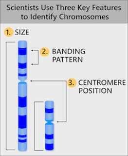

# Epigenetics

## Books
* The Epigenetics Revolution: How Modern Biology Is Rewriting Our Understanding of Genetics, Disease, and Inheritance
* Epigenetics Cold Spring Harbor Press, 2008

## Week 1
* Transgenerational effects, twins, and development as epigenetic processes
* Intro to histones, chromatin packing, transcription factors and gene expression

## Week 2
* DNA methylation, histone modifications, and epigenetic regulators
* The epigenetic code for gene silencing
* The epigenetic code for gene activation and long-distance regulation

## Week 3
* PcG proteins and RNA-mediated heterochromatin formation
* Imprinting

## Week 4
* X-inactivation
* Development revisited: reprogramming in PGCs
* iPS cells and Ageing

## Week 5
* Cancer epigenetics
* Neuroepigenetics

## Week 6

## Week 7

## Week 8

## Week 9

## Week 10

## Week 1
* Chromosome
1. Size. This is the easiest way to tell chromosomes apart.
2. Banding pattern. The size and location of Giemsa bands make each chromosome unique.
3. Centromere position. Centromeres appear as a constriction. They have a role in the separation of chromosomes into daughter cells during cell division (mitosis and meiosis).

