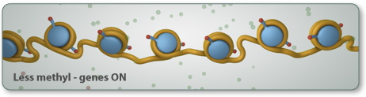
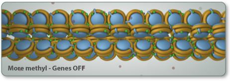

# Epigenetics

## Books
* The Epigenetics Revolution: How Modern Biology Is Rewriting Our Understanding of Genetics, Disease, and Inheritance
* Epigenetics Cold Spring Harbor Press, 2008

## Week 1
* Transgenerational effects, twins, and development as epigenetic processes
* Intro to histones, chromatin packing, transcription factors and gene expression

## Week 2
* DNA methylation, histone modifications, and epigenetic regulators
* The epigenetic code for gene silencing
* The epigenetic code for gene activation and long-distance regulation

## Week 3
* PcG proteins and RNA-mediated heterochromatin formation
* Imprinting

## Week 4
* X-inactivation
* Development revisited: reprogramming in PGCs
* iPS cells and Ageing

## Week 5
* Cancer epigenetics
* Neuroepigenetics

## Week 6

## Week 7

## Week 8

## Week 9

## Week 10

## Week 1
* Beyond the Central Dogma

RNA has many jobs in the cell, including jobs that have been traditionally associated with DNA and proteins. Read on to learn about how RNA can carry hereditary information, act as enzymes, and fine-tune protein production. And learn how advances in RNA technology are helping investigators study genes, as well as diagnose and treat diseases.

The DNA passes from parents to offspring over generations. But some viruses, including HIV, the virus that causes AIDS, use RNA to carry genetic information. RNA viruses are known as retroviruses.

Some RNA molecules can silence specific genes, turning off the production of proteins that are not needed at a certain place or time. This job is especially important during development, when cells begin to differentiate into specific types, such as muscle, skin, and liver. Each cell type needs only a fraction of its total genes to be active in order to do its job. Gene-silencing RNA molecules recognize specific genetic sequences through complementary base-pairing. These RNA molecules can shut down portions of the genome, turning off protein production. RNA does this by recruiting proteins to modify histones (or the epigenome). Modified histones wrap DNA tightly, making it inaccessible to transcription machinery.

* Chromosome
1. Size. This is the easiest way to tell chromosomes apart.
2. Banding pattern. The size and location of Giemsa bands make each chromosome unique.
3. Centromere position. Centromeres appear as a constriction. They have a role in the separation of chromosomes into daughter cells during cell division (mitosis and meiosis).

* What is Epigenetics

As an organism grows and develops, carefully orchestrated chemical reactions activate and deactivate parts of the genome at strategic times and in specific locations. Epigenetics is the study of these chemical reactions and the factors that influence them. Signals from the outside world can work through the epigenome to change a cell's gene expression.

Cancer can begin when mutation changes a cell's DNA sequence. But cancer cells also have abnormal epigenomes. In many cancers, some genes are turned up and some are turned down -- often in the very same cells. Cancer is just one of a growing number of diseases that are being linked to abnormalities in the epigenome.

Cancer cells have a lower level of methylation (more active DNA) than healthy cells. Too little methylation causes:
1. Activation of genes that promote cell growth.
2. Chromosome instability: highly active DNA is more likely to be duplicated, deleted, and moved to other locations.
3. Loss of imprinting

